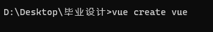
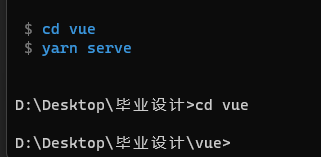
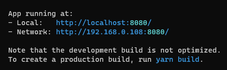
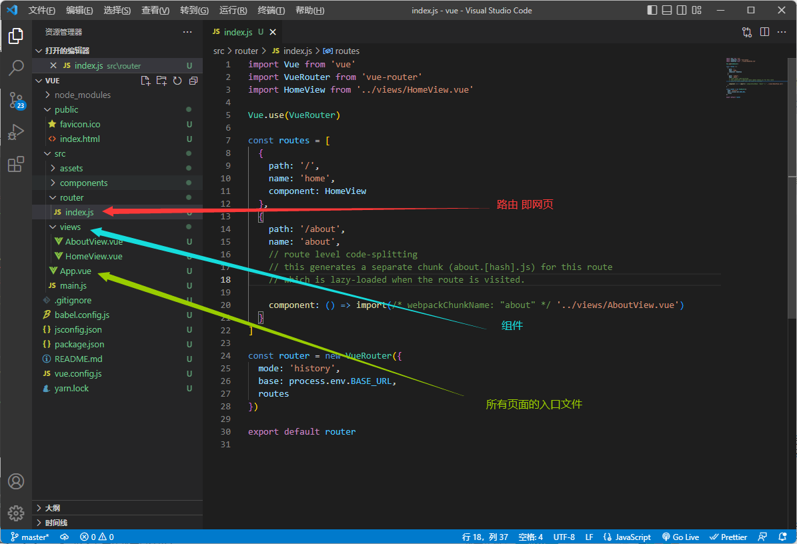
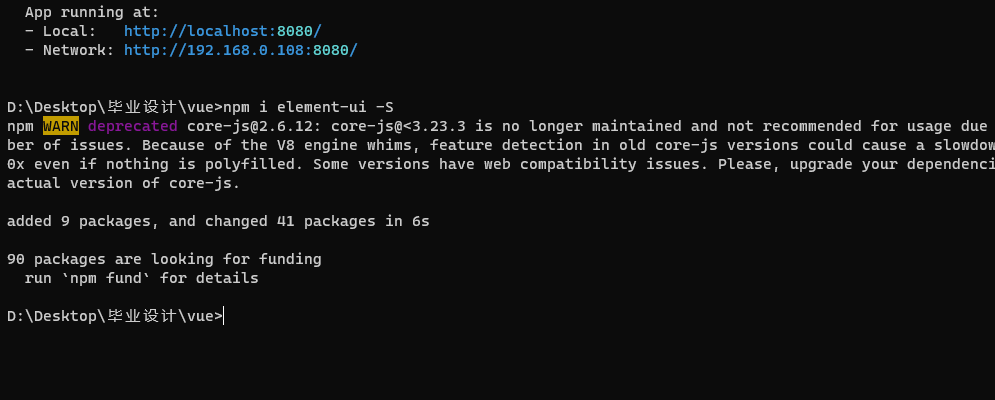
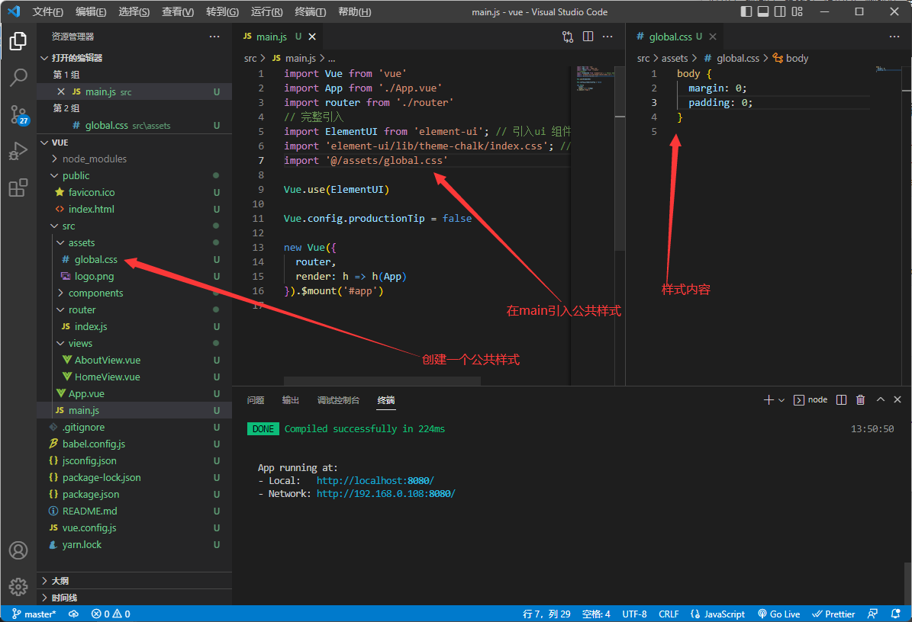

# 毕业设计

#### ##准备知识

JavaSE、servlet、JDBC、Maven、Mybatis、SpringMVC、SMM、Springboot

Mysql数据库简单的SQL语法

HTML、CSS、JS、vue2语法

使用Element-ui

官网：[Element - 网站快速成型工具](https://element.eleme.cn/#/zh-CN)

## 1 创建vue脚手架 以及搭建element-ui组件库

### 1.1

安装vue/cli:

详情请看另一个文档 包括淘宝镜像以及资源配置

### 1.2

配置需要安装的组件

### 1.3搭建脚手架

#### 1.3.1

创建一个vue脚手架



进入文件并运行



进入网页



#### 1.3.2 介绍文件




### 1.4 安装element-ui

```
npm i element-ui -S
```




#### 1.4.1引入组件库 以及组件库的样式

```javascript
import ElementUI from 'element-ui'; // 引入ui 组件库
import 'element-ui/lib/theme-chalk/index.css'; //ui 组件库的 css 样式
Vue.use(ElementUI) //使用ElementUI
```

也可也按需引入 （需要自己编写）

```
// 按需引入 element ui 组件
// import "./plugin/EleCoponent.js"
```

#### 1.4.1.扩展

在plugin下创建EleCoponent.js

```
// 1.引入 vue.js
import Vue from "vue";

import { Button,Switch } from "element-ui";

// 安装/使用 该组件
Vue.use(Button);
Vue.use(Switch);
```

### 2.1网站内容

#### 2.1.1编写公共样式

